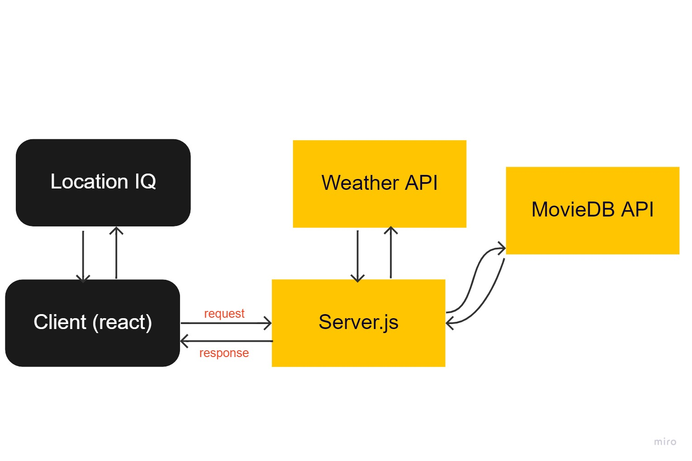

# City Explorer

**Author**: Osborn M Del Angel
**Version**: 1.0.0 (increment the patch/fix version number if you make more commits past your first submission)

## Overview
This is a city explorer app that can take you to your city once you input a name and give you information on the city. For Example: latitude, longitude, a map, and all the movies from the city.

## Getting Started
You need your own API key and a json file
## Architecture
In this app I used react, location IQ, and deployed with netlify and heroku.

## Change Log
In Progress

## Credit and Collaborations
TAs Michael Eclavea and google

Name of feature: city explorer

## deployed with
[Netlify](city-explorer-oz.netlify.app)
[Heroku](https://city-explorer-oz.herokuapp.com)

Estimate of time needed to complete: 3 hours

Start time: weeks ago

Finish time: 11/1/2021

Actual time needed to complete: ____cumalitive 4 hours_